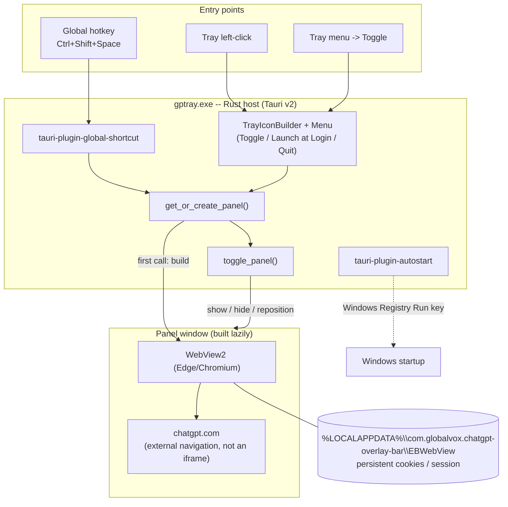
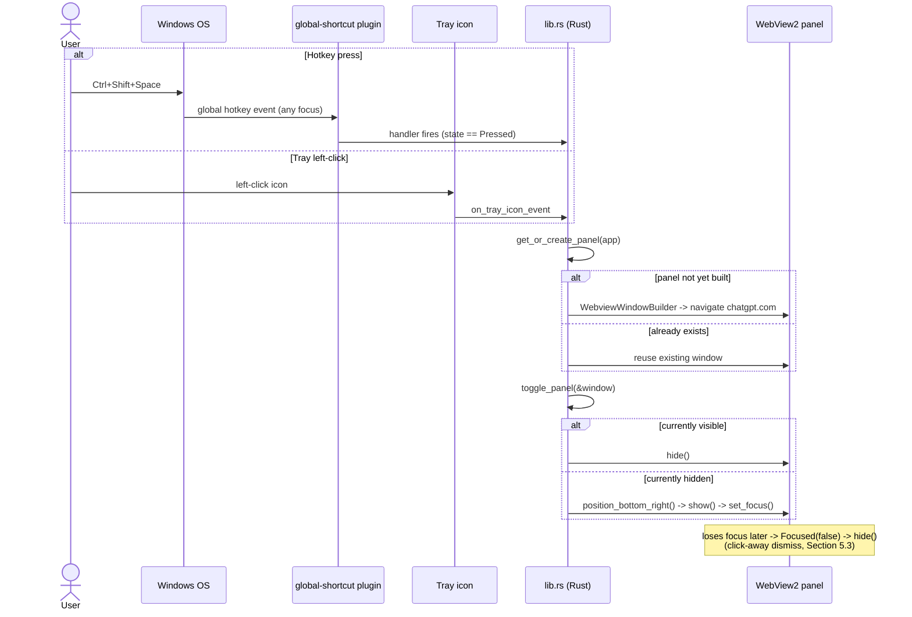

# gptray — Architecture

This document describes the actual, as-built architecture of `gptray` (package/product name `chatgpt-overlay-bar`), a finished and working Windows system-tray utility. It is not a proposal — every mechanism below is implemented and has been tested. Where a design choice was deliberately rejected (e.g. CSS reskinning), that is noted as a closed decision, not an open TODO.

## 1. System Overview

`gptray` gives instant, global-hotkey access to [chatgpt.com](https://chatgpt.com) from anywhere on Windows. It lives in the system tray, has no normal window/taskbar presence, and renders ChatGPT's own web app in a small borderless panel anchored near the tray.

It is a direct port of the idea behind [ik190/macos-chatgpt-overlay-bar](https://github.com/ik190/macos-chatgpt-overlay-bar) (a macOS menu-bar equivalent) to Windows.

**Primary design constraint: minimize idle RAM.** Every architectural decision in this codebase — the choice of Tauri over Electron, and especially the lazy webview-creation strategy in Section 2 — exists in service of that one constraint. Measured idle RAM before first use is **~12-27MB** (Task Manager / `Get-Process`).

### 1.1 Component diagram



Everything inside `Host` is the ~12-27MB idle process. Nothing in `Panel` exists until `get_or_create_panel()` builds it on first use (Section 2).

## 2. The Core Design Decision: Lazy Webview Creation

This is the single most important architectural choice in the codebase.

A typical Tauri app declares its window(s) statically in `tauri.conf.json`'s `app.windows` array, so the webview (and its WebView2 process) is created at app startup. `gptray` deliberately declares **no windows** there — `src-tauri/tauri.conf.json` has no `app.windows` key at all.

Instead, the one webview window (label `"panel"`) is built programmatically in Rust, on demand, by `get_or_create_panel()` in `src-tauri/src/lib.rs`:

```rust
fn get_or_create_panel<R: Runtime>(app: &AppHandle<R>) -> tauri::Result<WebviewWindow<R>> {
    if let Some(window) = app.get_webview_window(PANEL_LABEL) {
        return Ok(window);   // already built — reuse it
    }
    // ...build it for the first time...
}
```

Every entry point into the app (hotkey handler, tray "Toggle" menu item, tray left-click) calls `get_or_create_panel()` before doing anything else. It checks `app.get_webview_window("panel")` first and only runs `WebviewWindowBuilder` if the window doesn't exist yet.

**Why this matters:** WebView2 is Chromium under the hood. The moment a webview is created and navigated to a real page, Windows spawns the full multi-process Chromium architecture (browser process, gpu-process, renderer, network-service utility, storage-service utility, crashpad-handler) as children of the app's exe — confirmed via `Get-CimInstance Win32_Process` parent/child inspection during testing. That's several hundred MB (measured ~300-600MB+ combined WorkingSet, varying with content/DPI) that a normal Tauri app pays at launch, unconditionally, whether or not the user ever opens the window.

By deferring `WebviewWindowBuilder` until the first hotkey press or tray click, `gptray` pays that cost only if and when the user actually uses it. Until then, the process is just the small Rust host plus the tray icon and shortcut/autostart plugin machinery — hence the ~12-27MB idle figure.

Once built, the window is never destroyed. Subsequent toggles call `.hide()` / `.show()` on the existing `WebviewWindow`, not rebuild it — so repeat opens are instant and the ChatGPT login session and page state stay warm for the lifetime of the process.

**Framing:** the ~300-600MB+ figure once the panel is open is not something `gptray` adds — it is the fixed cost of rendering chatgpt.com's React SPA in any Chromium-based engine (the same cost a browser tab would carry). The architecture's contribution is making that cost *deferred and optional* rather than *paid unconditionally at launch*, which is exactly what Electron-based equivalents cannot do (Electron always owns its own bundled Chromium/Node runtime, resident from process start).

## 3. Component Breakdown

All logic lives in `src-tauri/src/lib.rs` (single file). `src-tauri/src/main.rs` is a trivial entry point:

```rust
fn main() {
    chatgpt_overlay_bar_lib::run()
}
```

### 3.1 Panel window / lifecycle

- **`get_or_create_panel()`** — get-or-build, described in Section 2. Window config: 400x600 (`inner_size`), `decorations(false)` (borderless, no OS titlebar), `always_on_top(true)`, `skip_taskbar(true)` (no taskbar entry, no alt-tab presence), `resizable(false)`, `shadow(true)` (native drop shadow), `visible(false)` + `focused(false)` (starts hidden/unfocused so it never flashes on creation), and `background_color(Color(13, 13, 13, 255))`.
  - The near-black background color is a deliberate polish detail: it's the color WebView2 paints before chatgpt.com's page finishes loading, so the panel doesn't flash white on first open. It was added after the initial build, at the user's request, to reinforce a dark/terminal feel.
  - **Explicitly rejected:** a full CSS reskin of chatgpt.com's own page content. Its DOM uses auto-generated/hashed class names that change on every OpenAI deploy, so any injected stylesheet would be fragile and high-maintenance. This is a documented trade-off, not a missing feature — the background-color trick is the extent of the visual theming this app does.
- **`toggle_panel()`** — checks `window.is_visible()`. If visible, `.hide()`. If hidden, calls `position_bottom_right()`, then `.show()`, then `.set_focus()`.
- **Hide-on-blur** — Tauri v2 has no built-in "close on focus loss" API, so it's done manually inside `get_or_create_panel()` at window-creation time: `window.on_window_event()` matches `WindowEvent::Focused(false)` and calls `.hide()`. This gives click-away-to-dismiss behavior. Confirmed working via direct Win32 window enumeration (`EnumWindows` / `IsWindowVisible`) during testing, not just visual inspection.
- **`position_bottom_right()`** — reads `window.primary_monitor().work_area()` (a `PhysicalRect`, which excludes the taskbar) and sets the window's position to the bottom-right corner of that work area with a 12px margin on both axes. This is what makes the panel behave like a flyout anchored near the tray rather than a normal centered window.

### 3.2 Navigation and session persistence

The window's content is `WebviewUrl::External("https://chatgpt.com")` — a real top-level external navigation, not a bundled local HTML page and not an `<iframe>`. Iframing chatgpt.com is blocked by its own `X-Frame-Options` / frame-ancestors headers, so the webview's top-level navigation has to go straight to the URL.

Session persistence comes for free from WebView2's per-app user-data directory, keyed off the Tauri `identifier` (`com.globalvox.chatgpt-overlay-bar` in `tauri.conf.json`): `%LOCALAPPDATA%\com.globalvox.chatgpt-overlay-bar\EBWebView`. Login cookies persist there across full app restarts — confirmed in testing, no re-login needed after the first sign-in.

### 3.3 Global hotkey

`tauri-plugin-global-shortcut` (v2.3.2). Inside `.setup()`:

```rust
let shortcut = Shortcut::new(Some(Modifiers::CONTROL | Modifiers::SHIFT), Code::Space);
app.handle().plugin(
    tauri_plugin_global_shortcut::Builder::new()
        .with_handler(move |app, hit_shortcut, event| {
            if hit_shortcut.id() == shortcut.id() && event.state() == ShortcutState::Pressed {
                if let Ok(window) = get_or_create_panel(app) {
                    toggle_panel(&window);
                }
            }
        })
        .build(),
)?;
app.global_shortcut().register(shortcut)?;
```

`Ctrl+Shift+Space` is registered as a true OS-level global hotkey, so it fires regardless of which window/app currently has focus (confirmed in testing from other foreground apps). `Shortcut` (`global_hotkey::hotkey::HotKey`) is `Copy`, which is why the same `shortcut` binding can be captured by value inside the `move` closure and then used again afterward for the `register()` call without a clone.

### 3.4 System tray

Built with `TrayIconBuilder` (the `tray-icon` Cargo feature, explicitly enabled in `Cargo.toml` since it isn't on by default), using `app.default_window_icon()` as the tray icon image.

Menu (`MenuBuilder`), top to bottom:
- **Toggle** — `get_or_create_panel()` + `toggle_panel()`.
- **Launch at Login** — a `CheckMenuItemBuilder` checkbox seeded from `tauri_plugin_autostart`'s `is_enabled()`. Clicking it calls `enable()` or `disable()` on the autolaunch manager and then `.set_checked()` to update the checkbox visual. Unchecked (off) by default — opt-in only.
- separator (`PredefinedMenuItem::separator`)
- **Quit** — `app.exit(0)`.

`show_menu_on_left_click(false)` splits click behavior: left-click toggles the panel directly (`on_tray_icon_event` matches `TrayIconEvent::Click { button: Left, button_state: Up, .. }`, then calls `get_or_create_panel()` + `toggle_panel()`); right-click shows the menu. Left-click deliberately does **not** compute a position from the tray icon's own rect — `toggle_panel()`'s open branch always calls `position_bottom_right()` regardless of entry point, so any tray-rect-based position would just be overwritten before the window ever became visible. Opening via tray-left-click and opening via the hotkey land in the same place (bottom-right, above the taskbar) for that reason.

### 3.5 Autostart ("Launch at Login")

`tauri-plugin-autostart` (v2.5.1), registered via `tauri_plugin_autostart::init(MacosLauncher::LaunchAgent, None)` in the builder chain. The `MacosLauncher` argument is required by the plugin's cross-platform API but is ignored on Windows — on this platform the plugin manages a registry Run-key under the hood via the `auto-launch` crate. Off by default; the user must explicitly check "Launch at Login" from the tray menu to enable it.

## 4. Why Tauri, Not Electron

The single deciding factor was idle RAM. Electron bundles and always runs its own Chromium + Node.js runtime, resident from the moment the process starts — there's no way to have an Electron app sit at ~15MB idle, because the runtime itself is the app.

Tauri v2 instead uses a thin Rust host and defers all rendering to the OS's native webview — on Windows, that's WebView2 (Edge/Chromium, already installed on virtually all modern Windows systems). Combined with the lazy-creation strategy in Section 2, this means:

- No bundled browser runtime shipped or loaded at rest.
- The Chromium cost only exists once a webview is actually constructed and navigated — which `gptray` defers until first use.
- Small binaries: release exe is 8.9MB, NSIS installer is 1.9MB.

The trade-off (Section 8) is that once the panel opens, WebView2's Chromium processes spin up just like Electron's would — this design doesn't make chatgpt.com cheaper to render, it makes the app free to leave running when you aren't using it.

## 5. Control Flow

Both entry points converge on the same two-function sequence: `get_or_create_panel(app)` then `toggle_panel(&window)`.



### 5.1 Hotkey press (`Ctrl+Shift+Space`)

1. OS delivers the global shortcut event to the process (works regardless of foreground app).
2. `tauri-plugin-global-shortcut`'s handler closure fires, checks `hit_shortcut.id() == shortcut.id()` and `event.state() == ShortcutState::Pressed`.
3. Calls `get_or_create_panel(app)` — first press ever: builds the panel window and starts WebView2 loading `https://chatgpt.com`. Subsequent presses: returns the existing window instantly.
4. Calls `toggle_panel(&window)` — if hidden: `position_bottom_right()` → `.show()` → `.set_focus()`. If visible: `.hide()`.

### 5.2 Tray click

- **Right-click** — native context menu appears (`show_menu_on_left_click(false)`); selecting "Toggle" runs the identical `get_or_create_panel()` + `toggle_panel()` pair via `on_menu_event`.
- **Left-click** — `on_tray_icon_event` matches `TrayIconEvent::Click { button: Left, button_state: Up, .. }`, calls `get_or_create_panel(app)`, then `toggle_panel(&window)` — whose `position_bottom_right()` call (on the opening path) determines the final on-screen position, as noted in 3.4.

### 5.3 Click-away dismiss

Independent of both entry points above: whenever the panel loses OS focus while visible, the `WindowEvent::Focused(false)` handler registered at window-creation time calls `.hide()`. This is what makes the panel feel like a transient flyout instead of a normal pinned window.

## 6. Security / Capability Model

`src-tauri/capabilities/default.json`:

```json
{
  "identifier": "default",
  "description": "Capability for the panel window",
  "windows": ["panel"],
  "permissions": ["core:default"]
}
```

This is the entire capability surface: `core:default` granted to the `panel` window, nothing else. This is intentionally minimal, not an oversight:

- No custom Tauri commands exist in this codebase — `invoke_handler` is never registered in `run()`.
- chatgpt.com's own page content has no idea Tauri exists and never calls into Tauri's JS bridge (`window.__TAURI__` is irrelevant to it).
- Every plugin interaction (tray, global shortcut, autostart) happens entirely Rust-side, inside `.setup()` closures and event handlers — never invoked from JS. There is therefore no ACL surface to lock down beyond the default, because there is no JS-to-Rust bridge in active use.
- `tauri.conf.json`'s `app.security.csp` is `null` (no CSP configured). This is acceptable here specifically because the panel only ever navigates to one hardcoded, trusted external URL (`https://chatgpt.com`) and exposes no Tauri command surface for a compromised page to call into.

## 7. Build / Release Pipeline

`tauri.conf.json`: `bundle.targets` is `["nsis"]` only — this is a Windows-only project, no macOS/Linux bundling is attempted. `bundle.windows.nsis.installMode` is `"currentUser"` (per-user install, no admin rights required, no UAC prompt).

Build:

```powershell
npm install
npm run tauri build
```

Produces:
- `src-tauri/target/release/chatgpt-overlay-bar.exe` — 8.9MB.
- `src-tauri/target/release/bundle/nsis/chatgpt-overlay-bar_0.1.0_x64-setup.exe` — 1.9MB.

The installer is unsigned (no code-signing certificate) — Windows SmartScreen warns once on first run. This is an accepted trade-off given the cost of a signing cert relative to the project's scope, not an oversight.

Frontend build step is effectively a no-op: `build.frontendDist` points at `../src`, which contains the unmodified vanilla-JS Tauri scaffold (`index.html`, `main.js`, `styles.css`, `assets/`). These files are bundled but never loaded at runtime, because the panel window navigates straight to the external chatgpt.com URL instead of `frontendDist`'s local `index.html`. They exist only because the `create-tauri-app` scaffolding generates them and nothing in the build depends on their removal.

## 8. File Layout

| Path | Purpose |
|---|---|
| `src-tauri/src/lib.rs` | All application logic — panel lifecycle, hotkey, tray, autostart (Section 3). |
| `src-tauri/src/main.rs` | Trivial entry point; calls `chatgpt_overlay_bar_lib::run()`. |
| `src-tauri/tauri.conf.json` | App config — no `app.windows` array (Section 2), bundle/NSIS settings, `csp: null`. |
| `src-tauri/Cargo.toml` | Dependencies: `tauri` (`tray-icon` feature), `tauri-plugin-global-shortcut` 2.3.2, `tauri-plugin-autostart` 2.5.1; `tauri-build` as build-dependency. |
| `src-tauri/capabilities/default.json` | Minimal capability grant (Section 6). |
| `src-tauri/icons/` | Default Tauri-scaffold icons — not custom-designed. |
| `src/` | Dead/unused scaffold frontend (vanilla JS template), never loaded at runtime. |

## 9. Known Trade-offs and Limitations

These are documented, accepted properties of the current design — not gaps to be filled:

- **RAM once opened.** Idle RAM (~12-27MB) only describes the pre-first-use state. Once the panel is opened, WebView2 spawns its normal Chromium child-process set and combined WorkingSet climbs to roughly 300-600MB+ (varies with content/DPI scale). This is the inherent cost of rendering chatgpt.com's React SPA in any Chromium engine — the same a browser tab would cost — and is not something this app adds on top. The architectural win is that this cost is deferred and optional, not that it's avoided.
- **Unsigned installer.** No code-signing certificate; SmartScreen shows a one-time warning on first run. Accepted trade-off given project scope.
- **No visual theming of chatgpt.com's content.** Beyond the near-black `background_color` shown during initial page load, the app does not and will not reskin ChatGPT's own DOM — its class names are auto-generated/hashed and change on every OpenAI deploy, making any injected CSS fragile. This was evaluated and deliberately rejected during the build.
- **Windows-only.** `bundle.targets` is `["nsis"]` only; no macOS/Linux packaging exists or is attempted, despite Tauri's cross-platform capability.
- **Single fixed panel size and position.** The panel is a fixed 400x600, not resizable, and always anchors to the bottom-right corner of the primary monitor's work area — there is no per-monitor selection logic or user-configurable size/position.
- **No CSP.** `app.security.csp` is `null`. Judged acceptable given the single hardcoded trusted origin and the absence of any exposed Tauri command surface (Section 6), but worth naming explicitly as a deviation from Tauri's hardened defaults.
